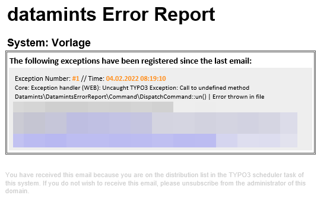

datamints_error_report
============

A TYPO3 extension for sending bundled error reports to a specified email address. Does NOT send e-mails at the moment when an exception occurs!

Links:

- [TER](https://typo3.org/extensions/repository/view/datamints_error_report)
- [Documentation](https://docs.typo3.org/p/datamints/error_report/master/en-us/)
- [Contact](mailto:m.weisgerber@datamints.com)

Features:
---------

- Provides a scheduler task for sending bundled error reports to a specified email address
- You can configure the max amount of error-entries per email to prevent huge emails
- Gathers all errors since the last report
- Provides a scheduler task for testing purposes by triggering an exception

Usage and installation:
---------

- See documentation: https://github.com/datamintsGmbH/datamints_error_report/tree/master/Documentation

Screenshots
---------

